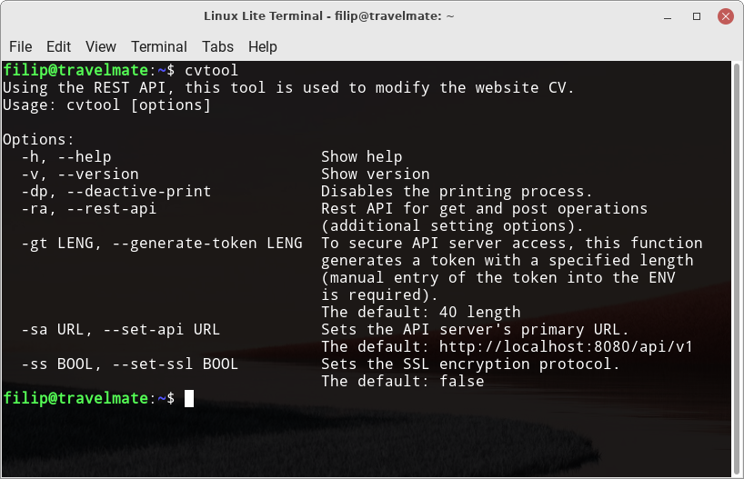
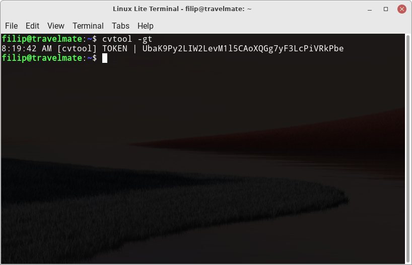
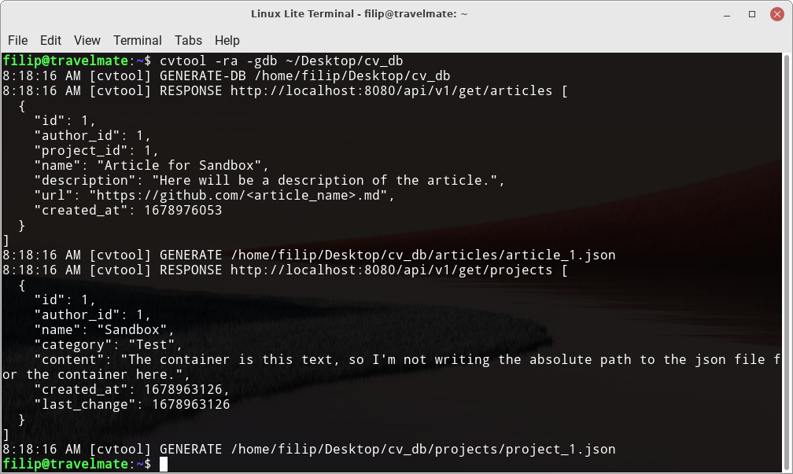
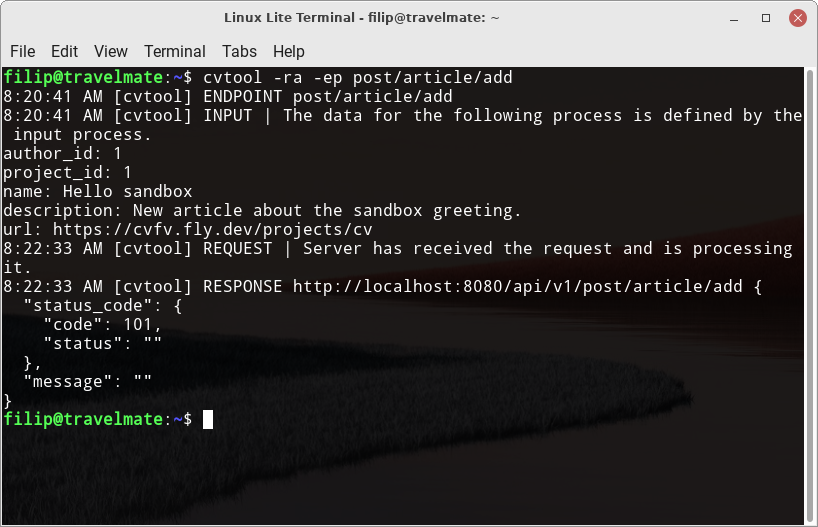
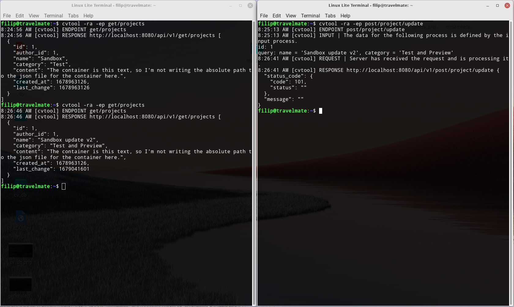

# CVTool
CVTool is a tool that has been specially developed to work with CV project. Its main function is to communicate with the CV site using the Rest API, which provides many endpoints that can be accessed using GET and POST methods.

But CVTool also offers other useful features for developers. For example, it allows you to generate a security token that is needed when implementing a CV project. It also allows you to easily download all the necessary information from the database, such as articles and projects, and export them to JSON format for CV site backup. These exported JSON files can be sent back to the CV site or used to create a custom content file for the endpoint and upload it.

### Content
- [1 Installation](#1-installation)
- [2 Using](#2-using)
    - [2.1 Rest API](#21-rest-api)
        - [2.1.1 GET](#211-get)
        - [2.1.2 POST](#212-post)
            - [2.1.2a Request Body](#212a-request-body)
                - [2.1.2a1 JSON Templates](#212a1-json-templates)
            - [2.1.2b Security Token](#212b-security-token)
        - [2.1.3 Generating a DB](#213-generating-a-db)
    - [2.2 Generating a Token](#22-generating-a-token)
    - [2.3 API Setup](#23-api-setup)
    - [2.4 SSL Setup](#24-ssl-setup)
- [3 Project structure](#3-project-structure)
- [4 Dependencies](#4-dependencies)
- [5 Articles](#5-articles)
- [6 Examples](#6-examples)
- [7 Licence](#7-licence)

## 1 Installation
You must have Ruby installed to install CVTool. The tool can be installed using the Ruby ecosystem *gem*.

Just use the following command:
```bash
gem install cv-tool
```

This command will automatically install the latest version of CVTool on your system and ensure it is set up correctly for use.

## 2 Using
The app offers the following features, that you can run with the appropriate arguments:

- **-h, --help**
    > Show help
- **-v, --version**
    > Show version
- **-dp, --deactive-print**
    > Disables the printing process.

- **-ra, --rest-api**
    > Rest API for get and post operations
    > (additional setting options).
    - **-ep ROUTE, --endpoint ROUTE**
        > Defining an endpoint to use in order
        > to access a specific function.
    - **-epl, --endpoints-list**
        > A list of endpoints is printed.
    - **-reb PATH, --request-body PATH**
        > The information that must be sent
        > as *request.body* via a json file.
        > (The location to the *.json* file must be
        > entered if this option is chosen;
        > else, the data must be manually entered
        > via the terminal input.)
    - **-gdb PATH, --generate-db PATH**
        > It creates *json* files for Projects and
        > Articles in the defined path (it obtains
        > the relevant data from the Rest API, which
        > is then sorted and saved).

- **-gt LENG, --generate-token LENG**
    > To secure API server access, this function
    > generates a token with a specified length
    > (manual entry of the token into the ENV
    > is required).
    > The default: 40 length
- **-sa URL, --set-api URL**
    > Sets the API server's primary URL.
    > The default: http://localhost:8080/api/v1
- **-ss BOOL, --set-ssl BOOL**
    > Sets the SSL encryption protocol.
    > The default: false

### 2.1 Rest API
For the REST API to work properly, you must set the correct values for the **--set-api** and **--set-ssl** arguments. Once successfully set, the REST API can be accessed using the **--rest-api** argument. This argument opens up additional options for selecting the desired functionality, the basic idea being to fill the **--endpoint** argument with the given route.

To better navigate through the available endpoints, the **--endpoints-list** argument is available to print a list of routes.

*Below is a list of available endpoints:*
- *Article:*
    - **get/articles**
    - **post/article/add**
    - **post/article/free**
    - **post/article/update**

- *Project:*
    - **get/projects**
    - **post/project/add**
    - **post/project/free**
    - **post/project/update**

- *Profile:*
    - **get/profiles**
    - **post/profile/add**
    - **post/profile/free**
    - **post/profile/update**

- *Table:*
    - **post/tables/reset**

### 2.1.1 GET
To get the necessary information using the GET method, you must use the selected endpoint that starts with *get/* in the route. *If we need to get information about articles, we can use the following command in the terminal:*

```bash
cvtool -ra -ep get/articles
```

### 2.1.2 POST
To use the POST method, it is accessed using the selected endpoint, which starts with *post/* in the route. *If you need to create a new project, you can use the following command, which will then prompt you for additional information:*

```text
cvtool -ra -ep post/project/add
...
author_id: 1
name: Sandbox 
category: Test 
content (a file's path): Content is this text, so I'm not writing the absolute path to the json file for content here.
...
```

### 2.1.2a Request Body
For all endpoints starting with *post/* in the route, there is an option to use the **--request-body** argument, where you can specify the path to the JSON key file for the endpoint.

*If you want to create a new article for an existing project, you can do the following:*
 
1. Get the project ID using the command:
    ```bash
    cvtool -ra -ep get/projects
    ```
2. Create a JSON file named *article_1.json* that contains the following keys for the article:
    ```json
    // article_1.json
    {
        "author_id": 1,
        "project_id": 1,
        "name": "Article for Sandbox",
        "description": "Here will be a description of the article.",
        "url": "https://github.com/<article_name>.md"
    }
    ```
3. Then you can use the command below and add the created *article_1.json* file as the **--request-body** argument. Then the command will run and everything will be automatically executed without having to fill in any more information about the project in the terminal.

    *Sample command:*
    ```bash
    cvtool -ra -ep post/project/add --request-body /home/filip/artcile_1.json 
    ```

### 2.1.2a1 JSON Templates
You can find more templates for *json* files and a complete list at the following link:

- [JSON Templates](/docs/json_templates.md)

> ### Info
> The endpoint **post/tables/reset** has no *JSON* template because there is no need to append any information to the request body. This endpoint is used to reset tables and does not need any data for its execution.

### 2.1.2b Security Token
To use the POST method in CVTool, you must have a security token inserted into the UNIX environment. If you do not have such a token in your environment, the POST method will not be executed.

To insert a security token, do the following:

1. Open the *.bashrc* file in your home directory with the command: 
    ```bash
    nano ~/.bashrc
    ```
2. At the end of the file, add an export line for the **CV_TOKEN** variable, where the value is your security token.

    *For example:*
    ```txt
    export CV_TOKEN="iq9ZLdFB6NI2PlUBSy1gMXAwVEIJ1OTedarIaRDQ"
    ```
3. Save the file to insert the security token into the UNIX environment.

### 2.1.3 Generating a DB
Backing up your CV site database to a local drive is a tool that allows you to download all the information you need for articles and projects. The **--generate-db** command selects only the relevant information and saves it individually in *JSON* files, article by article and project by project. To back up the database, specify the path to the destination folder as an argument to the command.

The procedure for generating the DB is as follows:

1. Generate a DB to a specific folder using the following command:

    ```bash
    cvtool -ra --generate-db ~/Desktop/cv_db
    ```

When the process is complete, the program will print information about what files have been generated. All articles and projects are stored in the *"~/Desktop/cv_db"* folder.

*The structure of this folder should look like this:*

```txt
~/Desktop/cv_db
├── articles
│   └── article_1.json
└── projects
    └── project_1.json
```

### 2.2 Generating a Token
To generate a new security token, you can use the **--generate-token** command, for which you can define the length of the token. If you do not define a token length, the program will automatically generate a token of 40 characters.

*Here is an example of a command to generate a security token:*

```bash
cvtool --generate-token
```

*Save the generated security token in the UNIX environment. If you don't know how to store the security token in the environment, read this snippet:*

- [2.1.2b Security Token](#212b-security-token)

### 2.3 API Setup
To fully manipulate the API within the CVTool program, the API URL must be set. The **--set-api** attribute is used to set the desired address. The default address that is set for the local server used within the CV project development environment is *"http://localhost:8080/api/v1"*.

*If we want to change the API URL, we can use the following command:*

```bash
cvtool --set-api https://cvfv.fly.dev
```
This command can be used to change the URL to the desired one.

### 2.4 SSL Setup
SSL (Secure Sockets Layer) is a technology that provides encrypted communication between a web server and a client and provides security for the transmission of sensitive data. To activate SSL, we need to use the **--set-ssl** attribute and set it to *"true"*. The default value is *"false"* because the local server usually does not need this security feature for testing.

*To activate SSL, use the following command:*

```bash
cvtool --set-ssl true
```

> ### Info
> If you have already uploaded a CV site, for example, as part of *fly.io*, you need to activate SSL.

## 3 Project structure
This project is written in Ruby programming language. All scripts use only the module and no class object is used.

*The project is divided into the following components:*

```txt
.
├── app
├── bin
├── lib
└── test
```

*Folder description:*

- **app**: The folder contains scripts for the CLI application. Here you will find scripts for handling the terminal. The scripts that are used are listed below:

    - *arguments.rb*: Contains all the arguments for the CVTool.
    - *configuration.rb*: Configuration for CVTool, stores the necessary information that does not need to be specified as arguments.
    - *inputs.rb*: Includes the processing of inputs from the terminal when the terminal requests the input needed to send an API request.
    - *main.rb*: The main script that is executed each time the application starts.
    - *signals.rb*: Contains all the necessary UNIX signals that CVTool receives.

- **bin**: Contains the executable files that are:

    - *build*: A script written in Ruby that creates a gem package and uploads it to the Ruby Gem.
    - *cvtool*: Runs the *main.rb* script.
    - *test*: A script written in bash that executes certain tests that are broken down by number. To run a test with the number one, you type 1 after the executable.

- **lib**: Contains all the application logic.
- **test**: Contains the files needed to execute the tests.

## 4 Dependencies
This CVTool tool can be run without installing additional gem packages. The only required dependency is a running CV site, either locally or publicly.

Here is a link to the CV repository:
- [cv-v](https://github.com/filipvrba/cv-v)

## 5 Articles
Here you will find several articles that provide more information about the CVTool project:

- [CV](https://cvfv.fly.dev/projects/cv)

## 6 Examples
Here are some pictures that illustrate the functionality of the CVTool tool.



(pic. 1) A terminal window displaying the cvtool help tool in execution.



(pic. 2) The tool generates a new security token.



(pic. 3) The figure shows a tool that generates a database from the test CV API and stores it on a local disk in a selected folder.



(pic. 4) The tool allows the creation of new articles and interactively queries the user for necessary information via the terminal.



(pic. 5) Two open terminal windows. The left window asks for project information and the right window asks to change the project using a command.

## 7 Licence
This project is opensource under the MIT license, programmed by [Filip Vrba](https://github.com/filipvrba) opensource developer.
